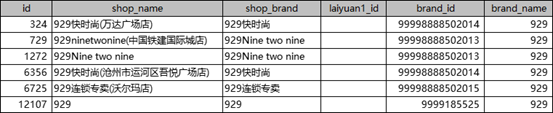

<h1>实体名生成与信息补全任务</h1>
<h2>题目描述：（实体名生成）</h2>

品牌与门店之间的准确匹配是市场分析和品牌管理的基础。然而，数据录入的不一致性、品牌名称的多样化表达以及品牌信息的更新滞后，都可能导致同一品牌在数据中被错误地识别为多个不同实体，造成品牌数量多的问题。本赛题要求参赛者使用适当的微调技术对给定的大语言模型进行微调，根据门店名称(shop_name)与门店品牌(shop_brand)生成品牌名称(brand_name)。考生使用微调后的模型在测试集上进行推理和生成。生成后的结果示例如下：

<h2>备注：</h2>

“brand_name”可信度优先级（由高到低）：“brand_name”来自“laiyuan1”—>brand_id为“9999*****”品牌—>brand_id为99998888****品牌 
“laiyuan1”的品牌：具有最高优先级，合并品牌时优先合并为来源1的品牌 
brand_id为“9999*****”品牌：具有次优先级，若品牌名称不是来源1的品牌，则合并品牌时优先考虑品牌ID为9999*****的品牌 
brand_id为“99998888*****”品牌：具有最低优先级，若品牌名称不是来源1的品牌且品牌ID不是9999*****的品牌，则将品牌合并为品牌ID为99998888****的品牌。

<h2>数据集描述: </h2>

训练集（文件夹“任务二train”中2.1train.xlsx）包含5000条门店与品牌的详细信息，包含门店名称（shop_name）、门店品牌(shop_brand)、是否来源1品牌(laiyuan1)、品牌id(brand_id)和品牌名称(brand_name)字段，用于训练模型；测试集（文件夹“任务二test”中2.1test.xlsx）包含1500条门店与品牌的详细信息，包含门店名称（shop_name）、门店品牌(shop_brand)、是否来源1品牌(laiyuan1)和品牌id(brand_id)字段；考生应生成测试数据集的品牌名称（brand_name）属性列。

<h2>任务描述：</h2>
<ol>
<li>
数据预处理
<ol>
<li>参赛者需要对给定的数据集进行预处理并划分训练集和验证集,保存处理后的数据集以备后续使用。</li>
</ol>
</li>
<li>
微调算法选择与实现
<ol>
<li>选择并实现一种高效的微调算法，如LoRA。</li>
<li>对大语言模型进行微调。</li>
</ol>
</li>
<li>
模型推理与评估：
<ol>
<li>使用微调后的模型在测试集上进行推理，考生应生成测试数据集的品牌名称（brand_name）属性列。</li>
<li>按《提交说明》的要求提交结果文件 “result2.json”。</li>
</ol>
</li>
</ol>
